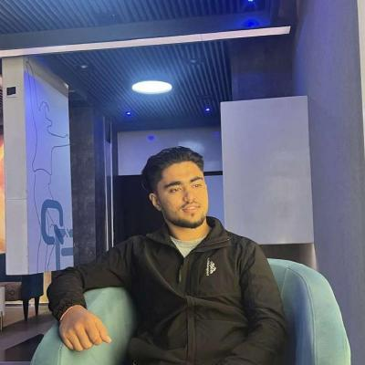

<div align="center">


# BIBEK DHAKAL

### Aspiring Software Engineer · AI & Machine Learning Enthusiast · Backend Developer


</div>

<br/>

<table align="center">
<tr>
<td valign="top" width="60%">

### 👨‍💻 About Me

```
Name........ Bibek Dhakal
Role........ Aspiring Software Engineer
Location.... Kathmandu, Nepal
Focus....... AI · Machine Learning · Backend Development
```

I'm a motivated **Computing student** with hands-on experience in software development, system design, and academic projects. My interests lie in Artificial Intelligence, Machine Learning, and backend development, with a focus on building scalable, real-world applications.

- 🔴 Strong foundation in programming & data structures
- 🟡 Experience with web systems, management apps, and academic projects
- 🔵 Comfortable with Git/GitHub and collaborative dev workflows
- ⚙️ Actively building projects toward AI-focused software roles

</td>
<td valign="top" width="40%" align="center">



</td>
</tr>
</table>

<br/>

<div align="center">

## 🛠️ Tech Stack


</div>

<br/>

## 📊 GitHub Stats

<div align="center"> 
  
    

</div> 

<br/>

## 🎯 Areas of Interest

<div align="center">

| 🔴 AI & ML | 🟡 Backend Dev | 🔵 System Design | ⚙️ SE Best Practices |
|:---:|:---:|:---:|:---:|
| Building intelligent, data-driven applications | Designing robust APIs & server-side logic | Optimizing for performance & scalability | Writing clean, maintainable, testable code |

</div>

<br/>

## 🤝 Connect With Me

<div align="center">

<!-- swap the # for your real links -->
<a href="https://www.linkedin.com/in/bibek-dhakal-7bb62a283/"></a>
<a href="https://mail.google.com/mail/u/0/#inbox?compose=GTvVlcSPFrLKXgMhRfNVrPBrRbqVfqVddxcdsbqHZDNpWMJXTmnXLMntdcSKVbdvtpVSxlTMGTrQb"></a>
<a href="https://www.instagram.com/bibek_dhakaal/?hl=en"></a>

</div>

<br/>

<div align="center">


<sub>⭐ Continuously learning, continuously building. ⭐</sub>
</div>
